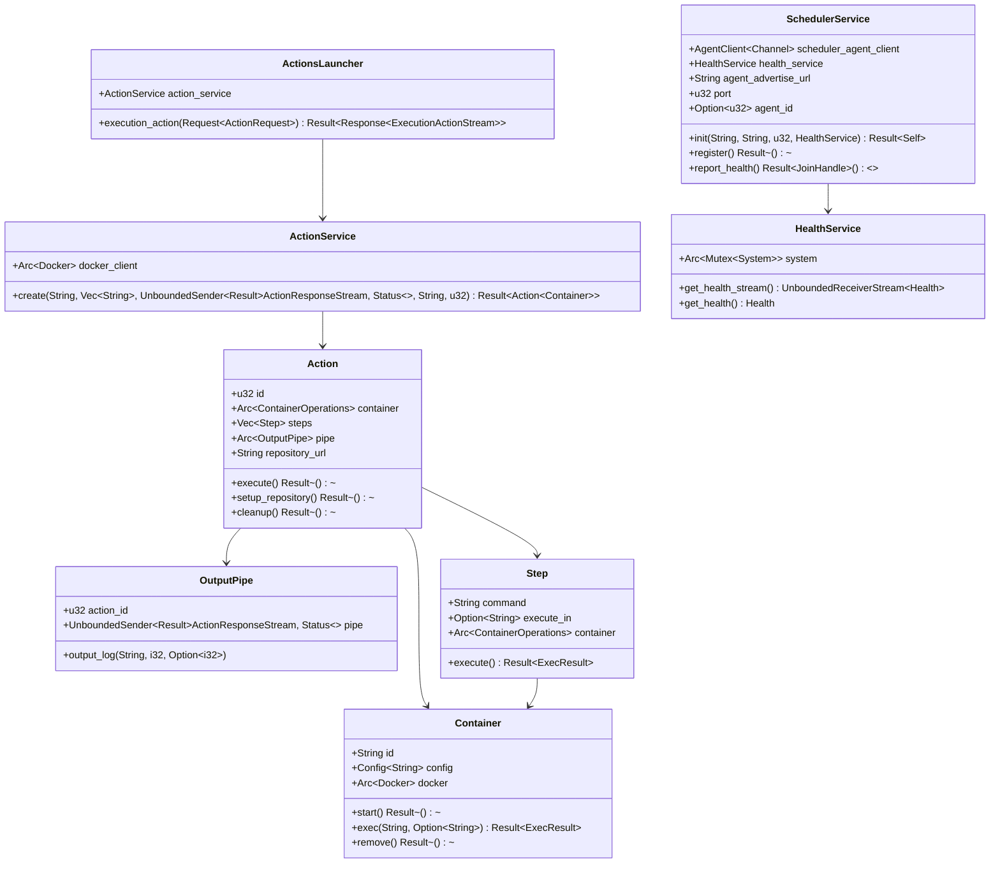

# SealCI Agent

## Overview

The SealCI Agent is a component of the SealCI system that interacts with a scheduler to execute actions within Docker containers. It provides functionalities to register with a scheduler, report health status, and execute actions based on commands received from the scheduler.

## Quick Start

First start a mock scheduler:
```sh
cargo run --bin scheduler_mock
```

Then start an agent:
```sh
cargo run --bin agent
```

## Workflow

1. **Initialization**:
   - The agent is initialized with configuration parameters such as the scheduler host URL, agent host URL, and port.
   - The agent sets up services for health monitoring, action execution, and communication with the scheduler.

2. **Registration**:
   - The agent registers itself with the scheduler by providing its host URL, port, and initial health status.

3. **Health Reporting**:
   - The agent continuously monitors its health (CPU and memory usage) and reports significant changes to the scheduler.

4. **Action Execution**:
   - The agent listens for action requests from the scheduler.
   - Upon receiving an action request, the agent creates a Docker container, clones the specified repository, and executes the provided commands within the container.
   - The output of the commands is streamed back to the scheduler.

## Code Structure

### Configuration

The configuration module (`config/mod.rs`) uses the `clap` library to parse command-line arguments for the scheduler host URL, agent host URL, and port.

### Main Entry Point

The main entry point (`main.rs`) initializes the agent, registers it with the scheduler, sets up health reporting, and starts the gRPC server to listen for action requests.

### Models

The models module contains the core data structures and logic for actions, containers, errors, output pipes, and steps.

- **Action**: Represents an action to be executed, including the container, steps, and repository URL.
- **Container**: Manages Docker container operations such as starting, executing commands, and removing containers.
- **Error**: Defines custom error types for various failure scenarios.
- **OutputPipe**: Streams the output of an action back to the scheduler.
- **Step**: Represents a single command to be executed within a container.

### Services

The services module contains the logic for interacting with Docker, monitoring health, and communicating with the scheduler.

- **ActionService**: Manages the creation and execution of actions within Docker containers.
- **HealthService**: Monitors the system's health (CPU and memory usage) and provides a stream of health updates.
- **SchedulerService**: Handles registration with the scheduler and reporting health status.

### Server

The server module (`server.rs`) implements the gRPC server that listens for action requests and delegates the execution to the `ActionService`.

## UML Diagrams

### Class Diagram



### Sequence Diagram


## Services Explanation

### ActionService

The `ActionService` is responsible for managing the lifecycle of actions. It creates Docker containers, sets up repositories, and executes commands within the containers. It streams the output of the commands back to the scheduler.

### HealthService

The `HealthService` monitors the system's health, including CPU and memory usage. It provides a stream of health updates that can be sent to the scheduler. This helps the scheduler make informed decisions about where to allocate tasks based on the agent's current load.

### SchedulerService

The `SchedulerService` handles communication with the scheduler. It registers the agent with the scheduler, providing its host URL, port, and initial health status. It also reports health status updates to the scheduler, ensuring that the scheduler has up-to-date information about the agent's health.