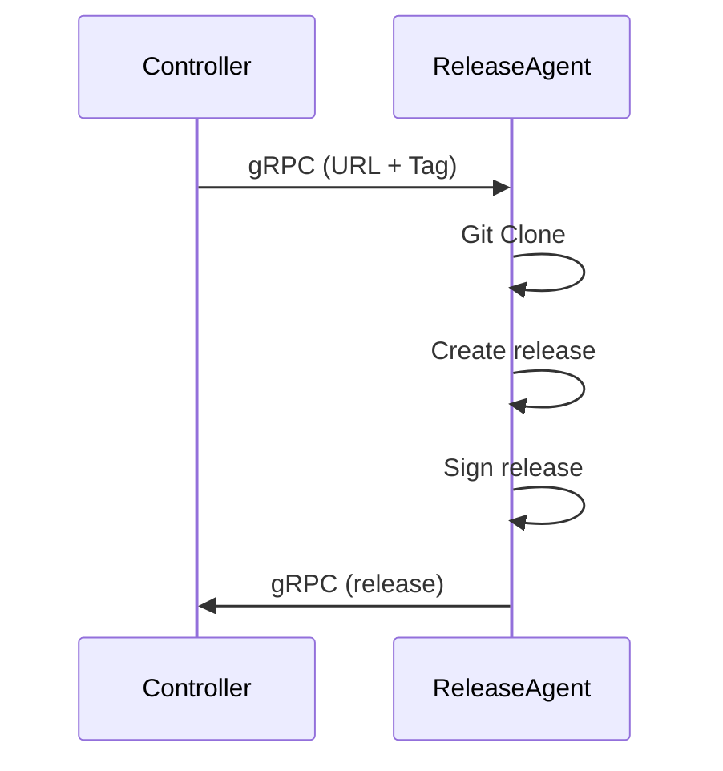
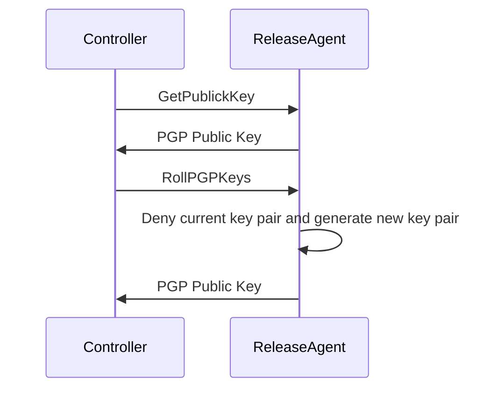

# Architecture Document for Release Agent Component

## Glossary

- **release** : A release is an archive ".git.tgz.sig" containing the source code of a project and its signature. The release is signed by the release agent using a private key. The public key is used to verify the signature. These keys make a pair of PGP keys.
- **release agent** : The release agent is a component that is responsible for creating and signing releases.

## Description

The release agent is a component that is responsible for creating and signing releases for any project. The release agent is designed to be used in a CI/CD pipeline.
When a watched repository contains a new tag, the controller triggers the release agent to create a release for the repository. Of course, the release agent is totally independent from the other services in seal ci's infrastructure.

## External Communication

The release agent runs inside a lumper controlled virtual machine (VM).
The release agent communicates with the Controller with gRPC (Getting URL + Tag of the repository which needs a release).
It sends the signed release to the Controller via virtio-net

## Keys Management

We chose to sign the releases with a PGP key to keep our plateform simple and as decentralized as possible. People using SealCI must thus be trustful of the release agent.

When the release agent is created it already contains a PGP key pair set by default. The key pair is provided at the generation of the initramfs when we are in a production environment. In a development environment, the key pair is generated on the fly.

There should be at least two interactions between the release agent and the controller when it comes to key management.
- **GetPublicKey** : The controller asks the release agent for the public key so the user can verify the signature of the release.
- **RollPGPKeys** : The controller asks the release agent to roll the PGP keys used to sign the releases because the keys should be rotated regularly and a PGP key can be compromise. In that scenario, the release agent should also issue a key denial certificate so users are aware of the compromise.

