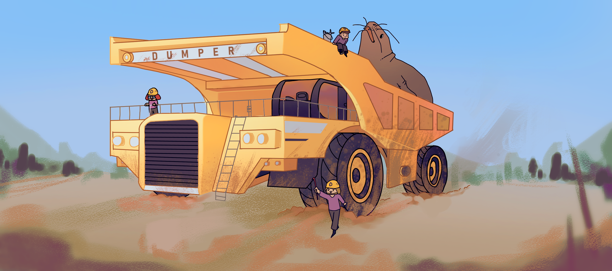

# Dumper




## Quick start

If you are not already in the dumper directory:
```sh
mkdir dumper/vm
cd dumper/vm
```

Get an alpine linux filesystem:
```sh
../scripts/fs.sh
```

Setup a kernel:
```sh
../scripts/kernel.sh
```
This one can take a while be patient.

Let's go to example to run the VM:
```sh
cd ../examples/quickstart/
```

```sh
ip tuntap add mode tap tap0
ip link set tap0 up
```

Then you can run the VM:
```sh
cargo run --example launch -- --kernel-path vm/linux-cloud-hypervisor/vmlinux --initramfs-path vm/initramfs.img
```
