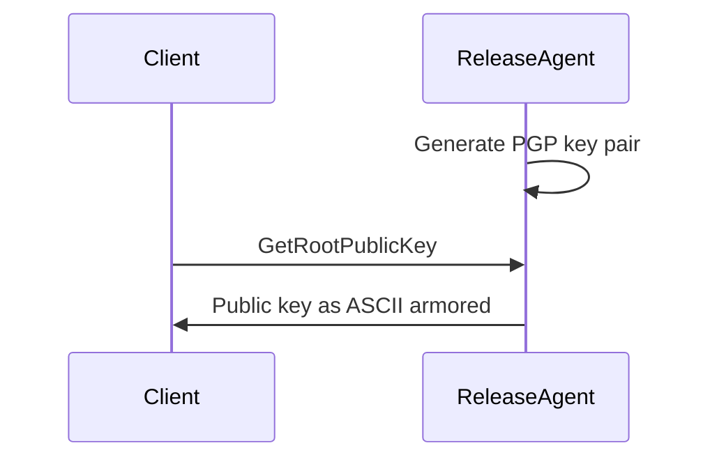
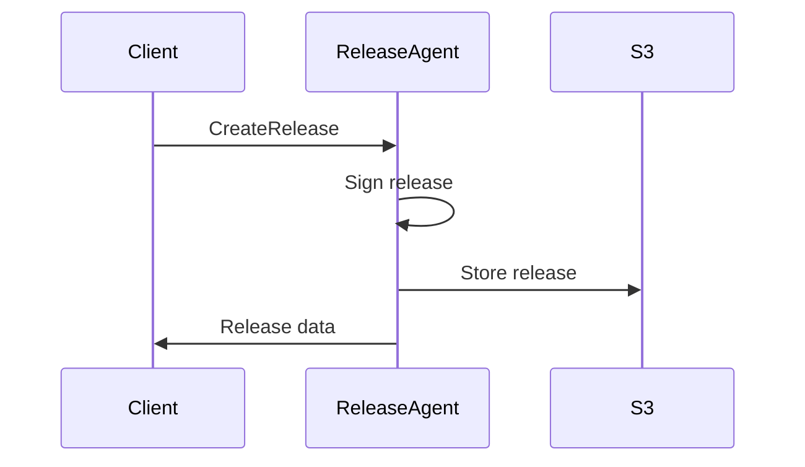

# Release Agent

The release agent is a microservice that is responsible for creating and publishing releases in a secured environment.

## Getting Started

### Prerequisites

- [Cargo](https://doc.rust-lang.org/cargo/getting-started/installation.html)
- [Sequoia PGP](https://sequoia-pgp.org/)

⚠️ Please don't use GPG, you [don't](https://www.youtube.com/watch?v=oZZXipqmSbw&t=1s) [want](https://www.latacora.com/blog/2019/07/16/the-pgp-problem/) [to](https://blog.cryptographyengineering.com/2014/08/13/whats-matter-with-pgp/) [be](https://www.usenix.org/system/files/conference/usenixsecurity18/sec18-poddebniak.pdf) [that](https://words.filippo.io/giving-up-on-long-term-pgp/) [guy.](https://mailarchive.ietf.org/arch/msg/openpgp/tB00vO5r-qneX9wz1xz3netpXVU/)

### Launch the release agent the quick way

```bash
docker compose --file prod-compose.yml up --build -d
```

Then go to [http://localhost:9001](http://localhost:9001) and create a new bucket named `sealci`.

### First launch the bucket

```bash
docker compose up -d
```

### Running the release agent (for development)

```bash
cargo run -- -p <key-passphrase> --cert-path <path-to-cert> --git-path <path-to-put-releases-temporarily>/tmp --bucket-access-key <aws-access-key> --bucket-secret-key <aws-secret-key> --bucket-name <bucket-name>
```

### Using the release agent as a library

```rust
    let config = Config::parse();
    tracing_subscriber::fmt().init();

    let cert_path = PathBuf::from(config.secret_key);

    // add signer
    let signer = SequoiaPGPSigner::new(cert_path, config.passphrase)?;
    // add bucket
    let bucket_client = MinioClient::new(config.bucket_addr, config.bucket_access_key, config.bucket_secret_key, config.bucket_name).await?;
    // add git
    let git_client = Git2Client::new(config.git_path);
    // add compress
    let compress_client = Flate2Client::new();

    let core = sealci_release_agent::core::ReleaseAgent::new(
        signer.clone(),
        bucket_client.clone(),
        git_client.clone(),
        compress_client.clone(),
    );
    let release_agent_grpc = sealci_release_agent::grpc::ReleaseAgentService::new(Arc::new(core), signer, bucket_client, git_client, compress_client);
    let app =
        sealci_release_agent::app::App::new(
            AppConfig { grpc: config.grpc },
            release_agent_grpc,
        );

    app.run().await?;

    Ok(())
```

## Architecture

When the release agent starts, it creates a PGP key pair and stores the public key on the filesystem.
Thus the release agent provides the `GetRootPublicKey` gRPC endpoint to retrieve the public key and so any service that needs verification can use it.



The release agent also provides the `CreateRelease` gRPC endpoint that creates a release and stores it in a S3 bucket.
 

